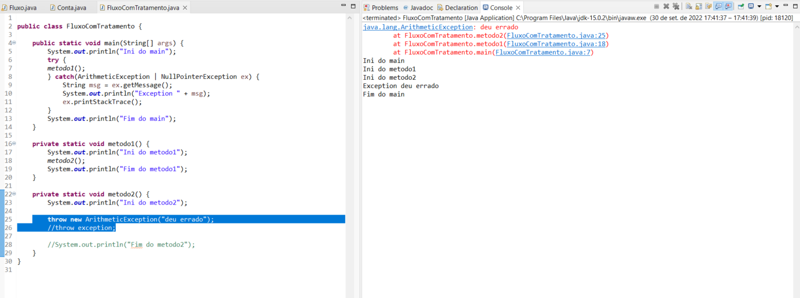
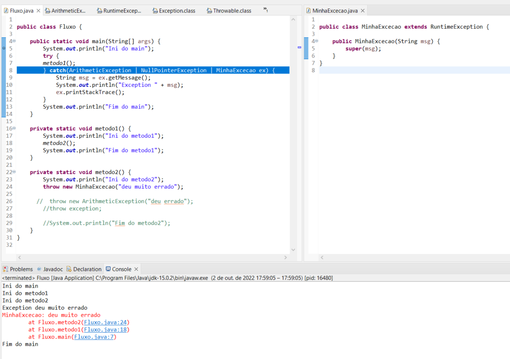
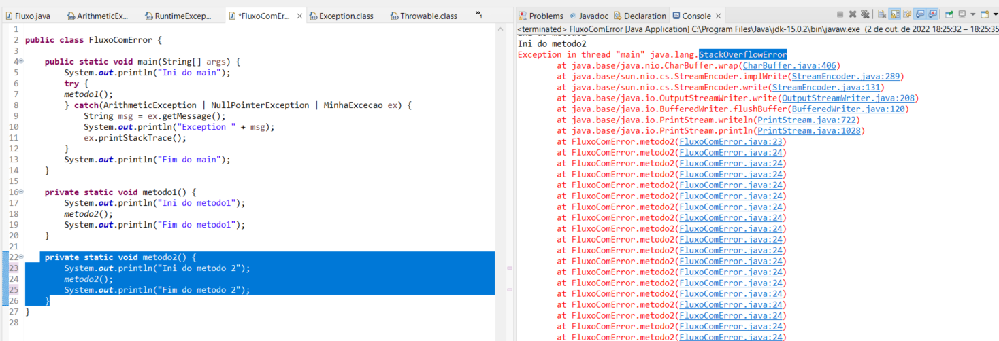

## Java Exceções: aprenda a criar, lançar e controlar exceções

**Faça esse curso de Java e:**

- Conheça a pilha de execução

- Use o modo de depuração (debug)

- Entenda o tratamento de exceções

- Crie suas próprias exceções checked e unchecked

- Lança as exceções para mudar o fluxo de seu programa

**Instrutor:** 
[Nico Steppat](https://github.com/steppat)

### 01. Pilha de execução

**Nessa aula, aprendemos:**

- O que é, para que serve e como funciona a pilha de execução.

- O que é depuração (debug) e para que serve.

- Como utilizar o Eclipse e sua perspectiva de debug.

- Como alternar entre perspectivas do Eclipse.

**Debug | Deburação**

### 02. Tratamento de execuções

**ArithmeticException**

**TryCatch**

**Try Catch - Pilha**

**Variação do Catch**

**Nessa aula, aprendemos:**

- O que são exceções, para que servem e porquê utilizá-las.

- Como analisar o rastro de exceções, ou stacktrace.

- Tratar exceções com os blocos **try-catch**.

- Manipular uma exceção lançada dentro do bloco catch.

- Tratar múltiplas exceções com mais de um bloco catch ou usando Multi-Catch utilizando o pipe (**|**).

### 03. Lançando exceções

**Nesta aula, aprendemos:**

- Como lançar exceções.

- Como atribuir uma mensagem à exceção.

### 04. Checked e Unchecked

**Hierarquia de Excecões**

**Entendendo Erros**

**O que aprendemos?**

Tópicos dessa aula:

- Existe uma hierarquia grande de classes que representam exceções. Por exemplo, **ArithmeticException** é filha de **RuntimeException**, que herda de Exception, que por sua vez é filha da classe mais ancestral das exceções, **Throwable**. Conhecer bem essa hierarquia significa saber utilizar exceções em sua aplicação.

- **Throwable** é a classe que precisa ser extendida para que seja possível jogar um objeto na pilha (através da palavra reservada **throw**)

- É na classe **Throwable** que temos praticamente todo o código relacionado às exceções, inclusive **getMessage()** e **printStackTrace()**. Todo o resto da hierarquia apenas possui algumas sobrecargas de construtores para comunicar mensagens específicas

- A hierarquia iniciada com a classe **Throwable** é dividida em **exceções** e **erros**. Exceções são usadas em códigos de aplicação. Erros são usados exclusivamente pela máquina virtual.

- Classes que herdam de Error são usadas para comunicar erros na máquina virtual. Desenvolvedores de aplicação não devem criar erros que herdam de **Error**.

- **StackOverflowError** é um erro da máquina virtual para informar que a pilha de execução não tem mais memória.

- Exceções são separadas em duas grandes categorias: aquelas que são obrigatoriamente verificadas pelo compilador e as que não são verificadas.

- As primeiras são denominadas checked e são criadas através do pertencimento a uma hierarquia que não passe por **RuntimeException**.

As segundas são as unchecked, e são criadas como descendentes de **RuntimeException**.

### 05. Aplicando exceções

**Nessa aula, aprendemos e praticamos:**

- como criar um bloco **catch** genérico usando a classe **Exception**;

- como criar uma exceção nova **SaldoInsuficienteException**;

- como transformar a exceção em checked ou unchecked.