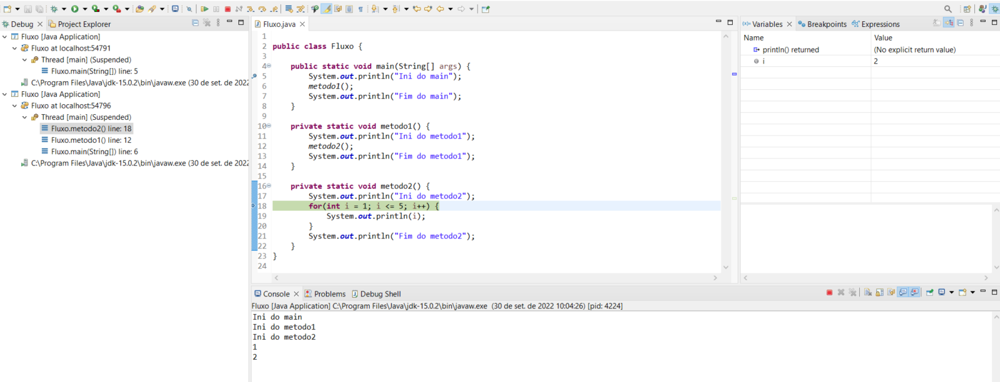
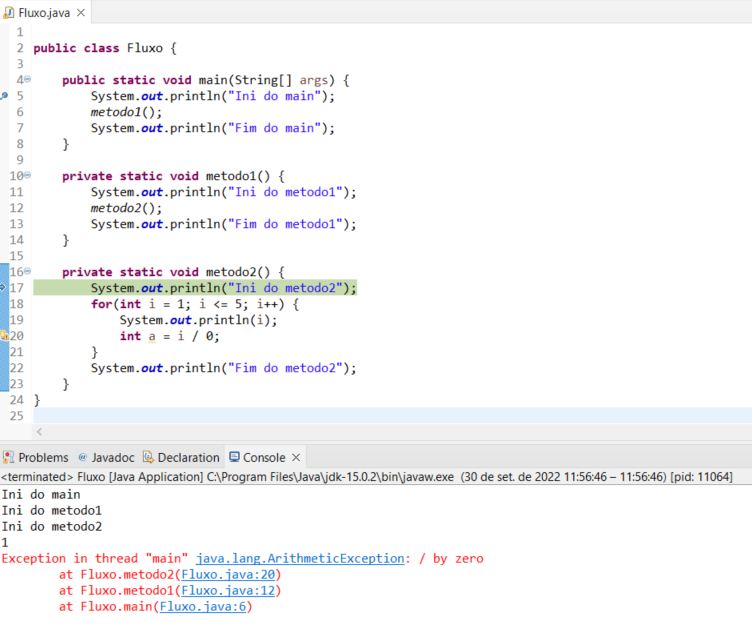
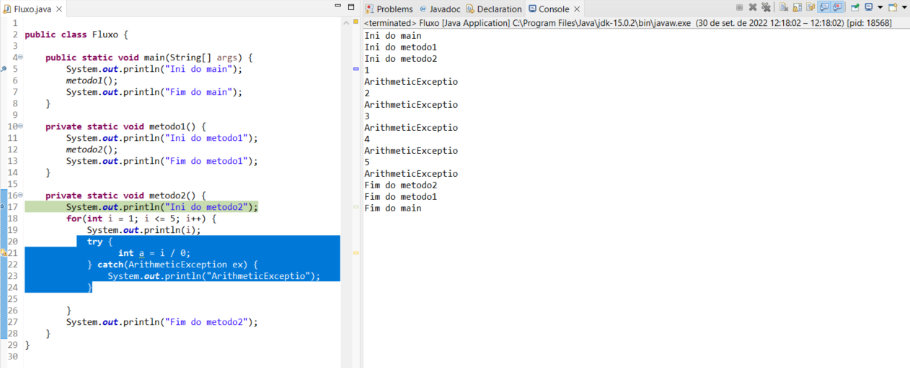
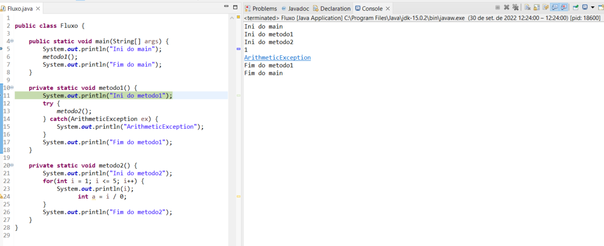
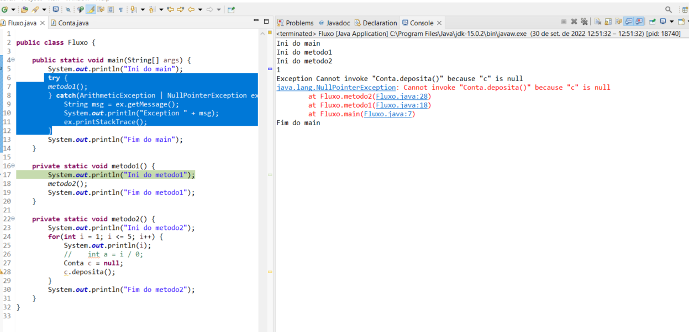

## Java Exceções: aprenda a criar, lançar e controlar exceções

**Faça esse curso de Java e:**

- Conheça a pilha de execução

- Use o modo de depuração (debug)

- Entenda o tratamento de exceções

- Crie suas próprias exceções checked e unchecked

- Lança as exceções para mudar o fluxo de seu programa

**Instrutor:** 
[Nico Steppat](https://github.com/steppat)

### 01. Pilha de execução

**Nessa aula, aprendemos:**

- O que é, para que serve e como funciona a pilha de execução.

- O que é depuração (debug) e para que serve.

- Como utilizar o Eclipse e sua perspectiva de debug.

- Como alternar entre perspectivas do Eclipse.

**Debug | Deburação**

### 02. Tratamento de execuções

**ArithmeticException**

**TryCatch**

**Try Catch - Pilha**

**Variação do Catch**

**Nessa aula, aprendemos:**

- O que são exceções, para que servem e porquê utilizá-las.

- Como analisar o rastro de exceções, ou stacktrace.

- Tratar exceções com os blocos **try-catch**.

- Manipular uma exceção lançada dentro do bloco catch.

- Tratar múltiplas exceções com mais de um bloco catch ou usando Multi-Catch utilizando o pipe (**|**).

### 03. Lançando exceções